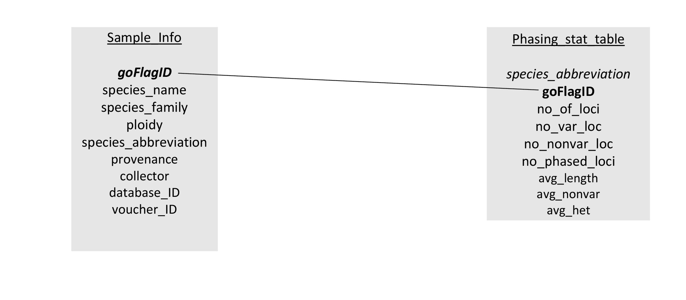

# Database design and architecture

We are going to build a relational database which will translate real-world relationships between our data entities into structural relationships between our data tables. Let’s take a look at the content and structure of the database:

```{r image2, eval = TRUE, echo = FALSE, fig.cap="Diagram of the cystpteridaceae database", fig.align='center', out.width='100%'}



```

The database is composed of 2 tables- the sample_Info and the phasing_stat table. The sample_info table includes individual information on the taxonomy, ploidy level and source of each species that are used in this project. The phasing statistics table provides the statistics for each sample (i.e. species) used in this project. Primary keys are in italics and foreign keys are in bold. The goFlagID is a unique number assigned to each species/sample and it is the foreign key that connects both tables

## Building the Database

We will build the database using RSQLite, which is an R package that provides an interface with SQLite such that you can interact with the database from within R.

RSQLite relies on another R package called DBI (which stands for database interface). DBI is a package that provides generic functions for interfacing databases with R, and RSQLite makes adjustments that are specific to SQLite. So, first things first, we are going to load the DBI package:

```{r, eval = FALSE, echo = TRUE}

library(DBI)
```


### Establising a database connection

The next step is to connect or rather create a new database and the `dbConnect` function performs this task. 

```{r, eval = FALSE, echo = TRUE}

my_db <- dbConnect(RSQLite::SQLite(), "my_db.db")

```

### Creating the sample_info table in the database 

To create, import, and plug the sample_info table in the database. Use the code below:

```{r, eval = FALSE, echo = TRUE}

# The line below creates the sample_info table in the database #
dbExecute(my_db, "CREATE TABLE sample_info (
                        goFlagID varchar(20) NOT NULL,
                        species_name varchar(30),
                        species_family char(20),
                        ploidy varchar(3),
                        species_abbreviation varchar(10),
                        provenance varchar(45),
                        collector varchar(20),
                        database_ID varchar(30),
                        voucher_ID varchar(30),
                        PRIMARY KEY (goFlagID)
                        );")

# The line below imports the sample_info data #

sample_info <- read.csv("sample_info.csv", stringsAsFactors = FALSE)


# The line below plugs the sample_info data into table #

dbWriteTable(my_db, "sample_info", sample_info, append = TRUE)


# The line below sends queries to the database  #
dbGetQuery(my_db, "SELECT * FROM sample_info LIMIT 10;")

```


### Creating the Phasing_stats_table in the database

To create, import, and plug the Phasing_stats table in the database. Use the code below:

```{r, eval = FALSE, echo = TRUE}

# The line below creates the Phasing_stats table in the database #
dbExecute(my_db, "CREATE TABLE Phasing_stats_table (
                        species_abbreviation varchar(10) NOT NULL PRIMARY                         KEY,
                        goFlagID varchar(20) NOT NULL,
                        no_of_loci INTEGER,
                        no_var_loc INTEGER,
                        no_nonvar_loc INTEGER,
                        no_phased_loci INTEGER,
                        avg_length float,
                        avg_nonvar float,
                        avg_het float,
                        FOREIGN KEY (goFlagID) REFERENCES                                        sample_info(goFlagID)
                        );")


# The line below imports the Phasing_stat data #

Phasing_stat_table <- read.csv("Phasing_stat_table.csv", stringsAsFactors = FALSE)


# The line below plugs the Phasing_stat data into table #

dbWriteTable(my_db, "Phasing_stat_table", Phasing_stat_table, append = TRUE)


# The line below sends queries to the database  #
dbGetQuery(my_db, "SELECT * FROM Phasing_stat_table LIMIT 10;")

```

