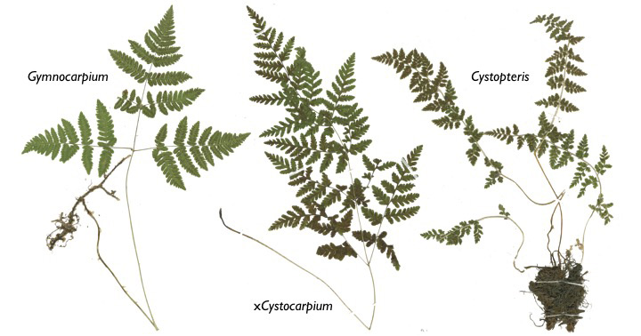

--- 
title: "Cystopteridaceae Phylogeny Project"
author: "Chinedum Anajemba"
date: "`r Sys.Date()`"
site: bookdown::bookdown_site
documentclass: book
bibliography: [book.bib, packages.bib]
# url: your book url like https://bookdown.org/yihui/bookdown
# cover-image: path to the social sharing image like images/cover.jpg
description: |
  This is a minimal example of using the bookdown package to write a book.
  The HTML output format for this example is bookdown::gitbook,
  set in the _output.yml file.
link-citations: yes
github-repo: rstudio/bookdown-demo
---

# Overview

```{r image1, eval = TRUE, echo = FALSE, fig.cap="Members of the Cystopteridaceae Family", fig.align='center', out.width='100%'}



```

Welcome to my Cystopteridaceae Phylogeny Project!

The major goal of this project is to build a **species-level phylogeny** of the Cystopteridaceae ferns using nuclear gene loci from the most recognized species of the family. Cystopteridaceae is a family of small or medium-sized ferns that live in forests and crevices. The family contains 3 genera and about 50 species. This study provides more insight into the evolutionary relationship in the Cystopteridaceae family. 
The content of this digital book is organized in the following Chapters:

Chapter 2: Database design and architecture


```{r include=FALSE}
# automatically create a bib database for R packages
knitr::write_bib(c(
  .packages(), 'bookdown', 'knitr', 'rmarkdown'
), 'packages.bib')
```
